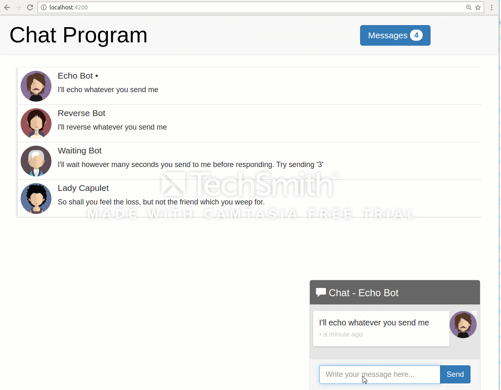
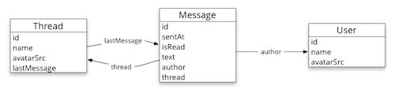
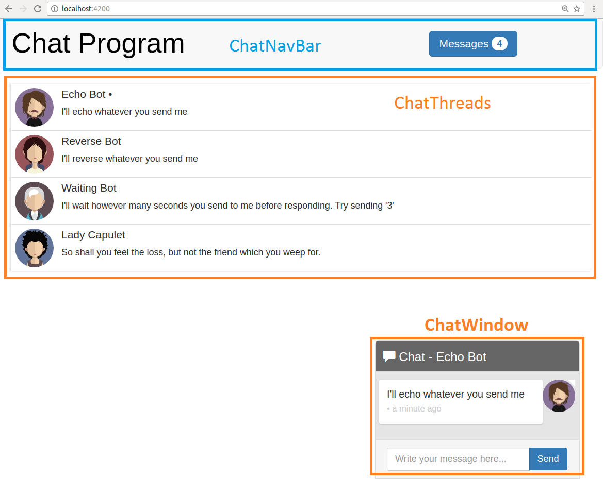
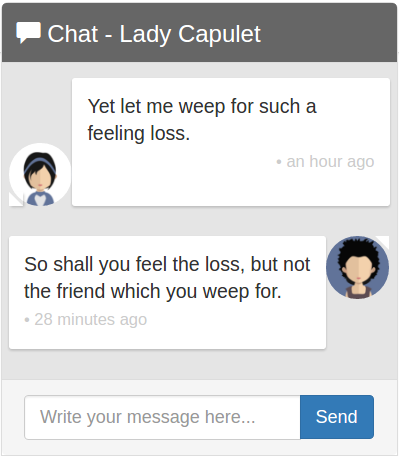

# Chat App using Angular 2 

### An chat app using [Angular 2](https://angular.io/), [TestBed](https://angular.io/), [RxJS](https://github.com/Reactive-Extensions/RxJS), [Angular CLI](https://github.com/angular/angular-cli), [Webpack](https://webpack.github.io/), [TypeScript](http://www.typescriptlang.org/), [Services](https://angular.io/), [Injectables](https://angular.io/), [Karma](http://karma-runner.github.io/), [Forms](https://angular.io/), and [tslint](http://palantir.github.io/tslint/).

This repo shows an example chat application using RxJS and Angular 2. The goal is to show how to use the Observables data architecture pattern within Angular 2. It also features:

* Angular CLI, which configures Webpack with TypeScript, Karma, and tslint
* Unit Test using TestBet
* Writing async components that work with RxJS
* How to write injectable services in Angular 2
* And much more



## Quick start

```bash
# clone the repo
git clone https://github.com/webappman/ChatApp.git

# change into the repo directory
cd ChatApp

# install
npm install

# run
npm start
```

Then visit [http://localhost:4200](http://localhost:4200) in your browser.

## Architecture

The app has three models:

* [`Message`](src/app/message/message.model.ts) - holds individual chat messages
* [`Thread`](src/app/thread/thread.model.ts) - holds metadata for a group of `Message`s
* [`User`](src/app/user/user.model.ts) - holds data about an individual user

<p align="center">
  
</p>

And there are three services, one for each model:

* [`MessagesService`](src/app/message/messages.service.ts) - manages streams of `Message`s
* [`ThreadsService`](src/app/thread/threads.service.ts) - manages streams of `Thread`s
* [`UserService`](src/app/user/users.service.ts) - manages a stream of the current `User`

There are also three top-level components:

* [`ChatNavBar`](src/app/chat-nav-bar/chat-nav-bar.component.ts) - for the top navigation bar and unread messages count
* [`ChatThreads`](src/app/chat-threads/chat-threads.component.ts) - for our clickable list of threads
* [`ChatWindow`](src/app/chat-window/chat-window.component.ts) - where we hold our current conversation

<p align="center">
  
</p>

## Services Manage Observables

Each service publishes data as RxJS streams. The service clients subscribe to these streams to be notified of changes.

The `MessagesService` is the backbone of the application. All new messages are added to the `newMessages` stream and, more or less, all streams are derived from listening to `newMessages`. Even the `Thread`s exposed by the `ThreadsService` are created by listening to the stream of `Message`s.

There are several other helpful streams that the services expose:

For example, the `MessagesService` exposes the `messages` stream which is a stream of _the list of the all current messages_. That is, `messages` emits an array for each record.

Similarly, the `ThreadsService` exposes a list of the chronologically-ordered threads in `orderedThreads` and so on.

## Bots

This app implements a few simple chat bots. For instance:

* Echo bot
* Reversing bot
* Waiting bot



<div style="clear:both"></div>

## Detailed Installation

**Step 1: Install Node.js from the [Node Website](http://nodejs.org/).**

We recommend Node version 4.1 or above. You can check your node version by running this:

```bash
$ node -v
v4.1...
```

**Step 2: Install Dependencies**

```bash
npm install
```

## Running the App

```bash
npm start
```

Then visit [http://localhost:4200](http://localhost:4200) in your browser.

## Running the Tests

You can run the unit tests with:

```bash
npm run test
```